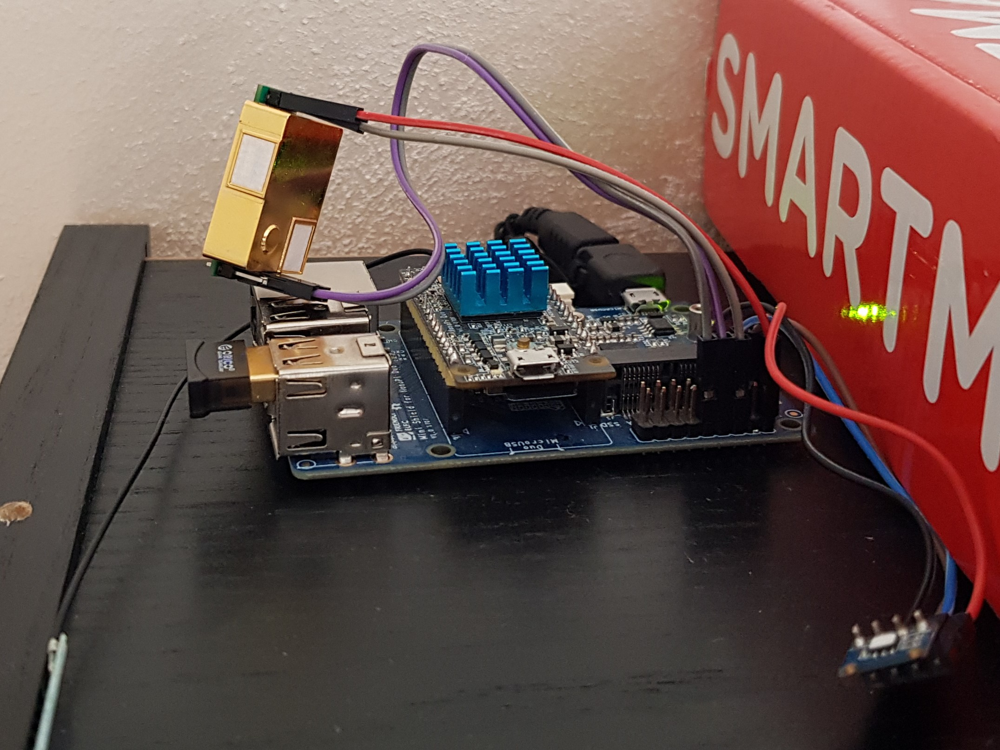

# NanoPI CO2 Sensor hat


## Introduction
NanoPI CO2 Sensor hat is a expansion board which has the same dimension as that of a NanoPi NEO/Air and can be stacked on:
- [NanoPi NEO Air](https://www.friendlyarm.com/index.php?route=product/product&path=69&product_id=151) | [WIKI](http://wiki.friendlyarm.com/wiki/index.php/NanoPi_NEO_Air)
- [NanoPi NEO-LTS](https://www.friendlyarm.com/index.php?route=product/product&path=69&product_id=132)
- [NanoPi NEO2](https://www.friendlyarm.com/index.php?route=product/product&path=69&product_id=180)
- [NanoPi NEO Core-LTS](https://www.friendlyarm.com/index.php?route=product/product&path=69&product_id=212)
- [NanoPi NEO Core2](https://www.friendlyarm.com/index.php?route=product/product&path=69&product_id=211)

Contains MH-Z19B, SI7021 and PCB 2.4GHz antenna.

## Hardware Spec
- MH-Z19B
- SI7021
- PCB Antenna

## Buying guide
- [MH-Z19B](https://buyeasy.by/redirect/cpa/o/pwrb51ps5k89nhkhnudr8rkgoolhpres/?to=https%3A%2F%2Fwww.aliexpress.com%2Fitem%2F32946106807.html)
- [SI7021](https://l.kool.ru/si7021)
- [1x12 pinheader](https://l.kool.ru/hdrf1r)
- [2x12 pinheader](https://l.kool.ru/hdrf1r)
- [IPX ( MHF4 IPEX MHF) pigtail 10 cm](https://l.kool.ru/pgtipx)


## Installation guide

0. Flash [Armbian](https://www.armbian.com/nanopi-neo-air/) 

1. install [PIP](https://pip.pypa.io/en/stable/installing/)

```
apt install python3-pip
```

2. install additional modules for [bluepy](https://pypi.org/project/bluepy/)

```
sudo apt-get install libglib2.0-dev python3-dev
```

3. Install [Python](https://www.python.org/) modules

```
pip3 install setuptools wheel bluepy smbus si7021 mh-z19 paho-mqtt
```

4. Install MQTT Gate script

```
tion.mqtt.py
```

5. Create service

...

6 PROFIT!

## Donation
If this project help you, you can give me a cup of coffee | beer | vodka :)

[](https://money.yandex.ru/to/41001197672478)

[](https://www.paypal.me/koolru)

